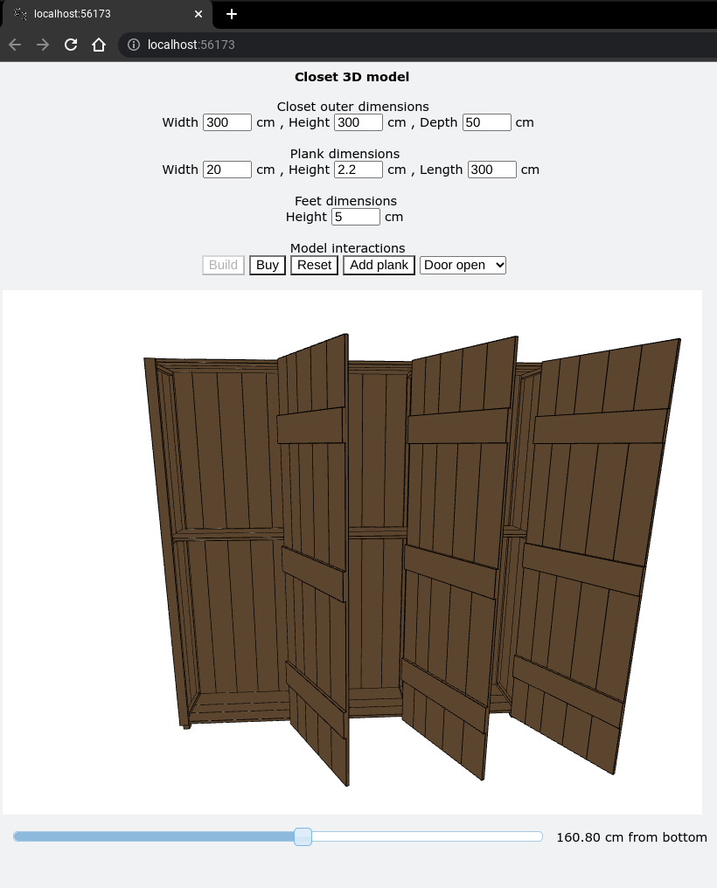

# Cupboard builder 

This python script enables you to create an assembly manual from a self designed cupboard with only three clicks of your mouse.
For an example of the manual see **EXAMPLE.pdf** in the root folder.

## Step 1

Prerequesites:
numpy
pandas
vpython
jupyterlab-vpython
*to be installed with pip or conda*

Firstly you run **main.py or main.ipynb** and fill in the sizes of your desired cupboard.
The top row of cells are the outer dimensions of the cupboard
In the second row of cells you input the plank size you would like to use to have your cupboard constructed from.

There is some basic logic implemented in the cells which prevent the user from inputting weird values.
For the second row for example, the height (or thickness) of the plank has to be smaller than the length or width and the width of the plank needs to be smaller than the length.
Furthermore, the length of the plank needs to be at least the length of the largest size of your cupboard design.

Once you have filled in these cells you can press **build**.

A good start to pkay around with the dimensions of the cupboard are the following:

You can open or hide the cupboard doors using the drop down menu on the right.

Once you have built the outer frame of the cupboard, you can add in the levels. One level is already inserted, you can change the height of the level by using the slider under the model of the cupboard. Press **add plank** to add another level and slider.

Press the **reset** button if you would like to start over.

Once you are happy with the design press **buy** to finalze your desing and more forward to step two.

## Step 2

*The following step will be automated in future versions*

Prerequesites:
numpy
scipy
pandas
vpython
pillow
matplotlib
opencv_python
*to be installed with pip or conda*
pdflatex
*to be installed with apt or npm*

Open main2.py.

Now that the general dimensions of the cupbord are known, you'll find a new foder in the **users** folder in the root of the folder. Copy the name of that directory and paste it in the **directory** variablie in main2.py.

Now run the file. Your browser will pup-up and generate assembly images for the final document, these are stored in your designated Downloads folder of your browser.

Once image 12 has been generated the program will pause. Go to your downloads folder, and copy the generated images to the new folder which was recently created in the user folder.

Now press **enter** to continue the program.

The programm will be automatically generate your pdf assembly manual and place it in the directory in the users directory.

Good luck building your cupboard!

 
